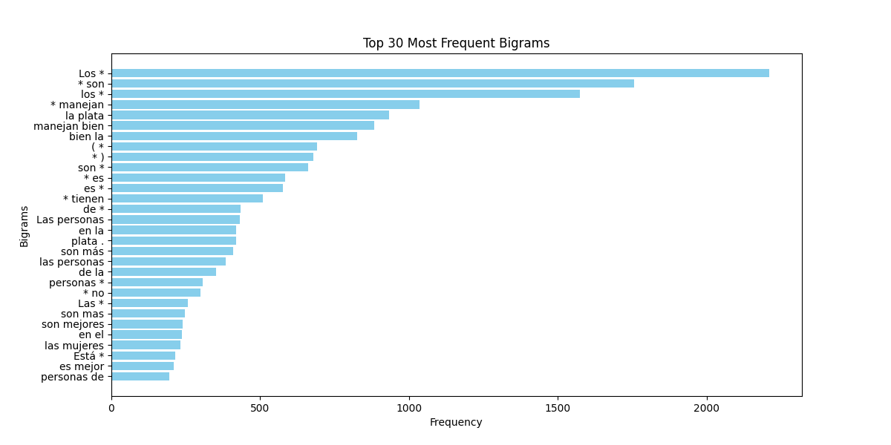
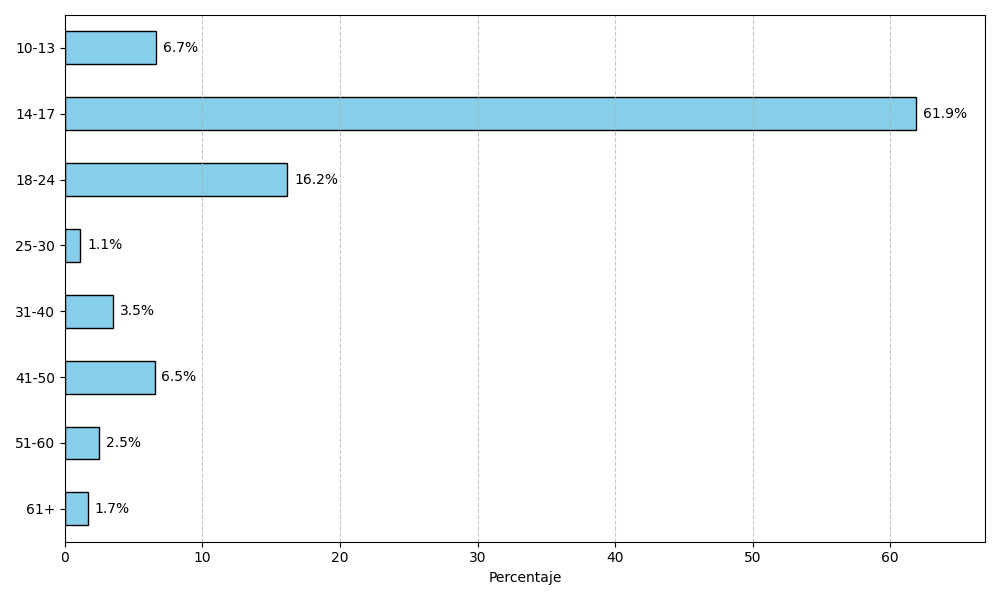
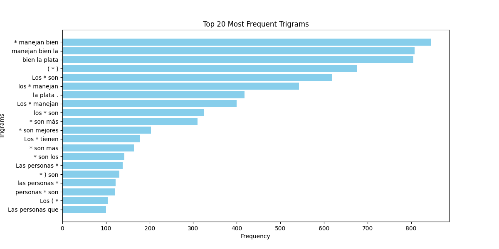
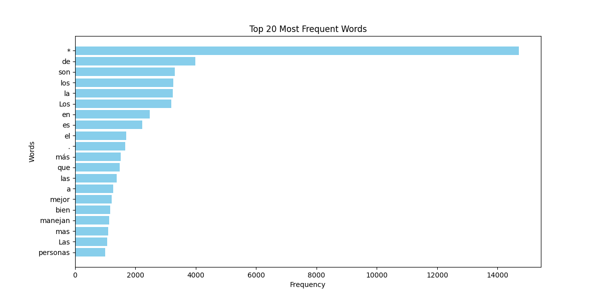
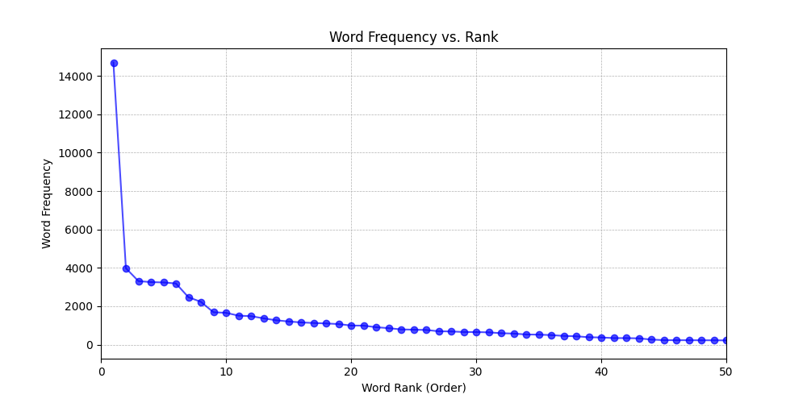
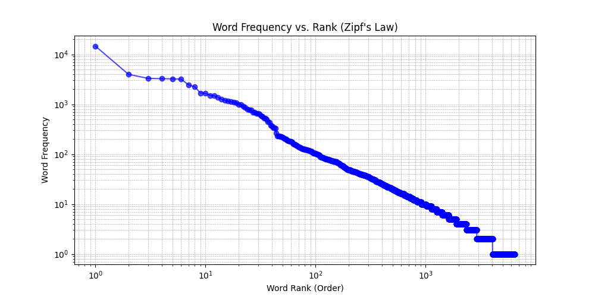

# Raw Version

Number of entries: 14,703

Number of entries with numbers: 297

Number of duplicate entries: 2,127

Total number of words: 108,585

Number of unique words: 6,551

Number of biases in the `tipo_de_sesgo_explorado` column: 23,015

Number of unique biases in the `tipo_de_sesgo_explorado` column: 610

Number of entries without age, school, or gender: 6,018

Entries by gender:

| Gender | Count |
|--------|-------|
| NaN    | 6,018 |
| F      | 4,183 |
| M      | 4,001 |
| X      |   501 |

Entries by age range:

| Age Range | Count |
|-----------|-------|
| 14-17     | 5,359 |
| 18-24     | 1,400 |
| 10-13     |   576 |
| 41-50     |   565 |
| 31-40     |   302 |
| 51-60     |   216 |
| 61+       |   145 |
| 25-30     |    96 |

Number of unique token IDs: 1,457

Average entries per token ID: 10.09

Median entries per token ID: 5

Number of unique schools: 189

Number of words in the word list: 46,499

Number of unique words in the word list: 6,547

Number of bigrams in sentences: 96,849

Number of unique bigrams in sentences: 20,335

Number of trigrams in sentences: 82,149

Number of unique trigrams in sentences: 28,661

## License

These datasets are licensed under the [Creative Commons Attribution-ShareAlike 4.0 International License](https://creativecommons.org/licenses/by-sa/4.0/).

## Contact

For any questions or inquiries, please contact guidoivetta@mi.unc.edu.ar

