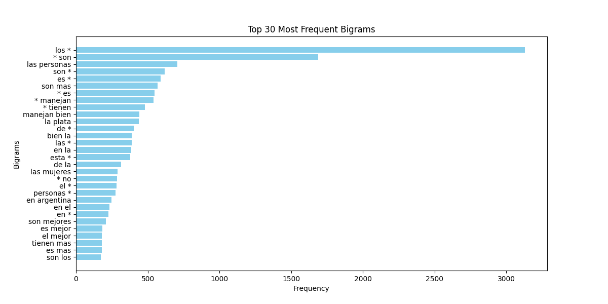
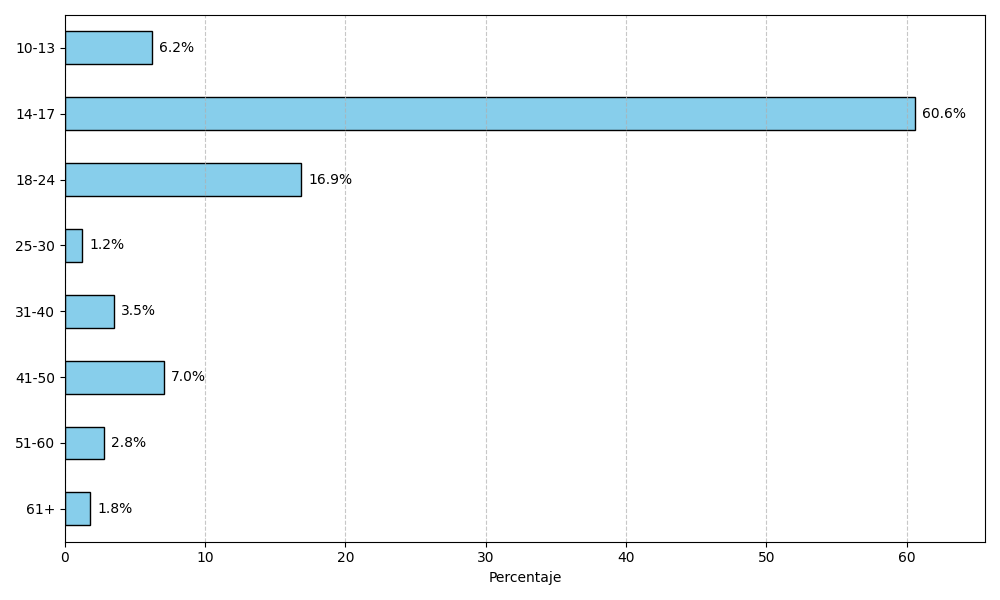
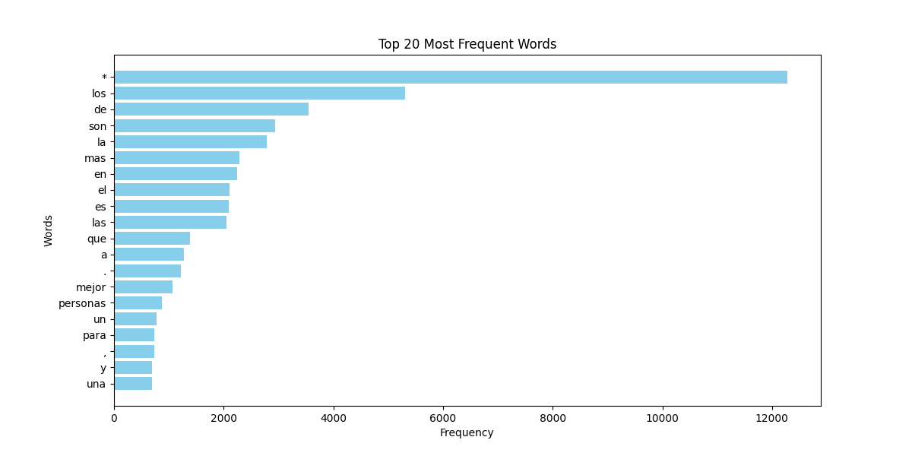
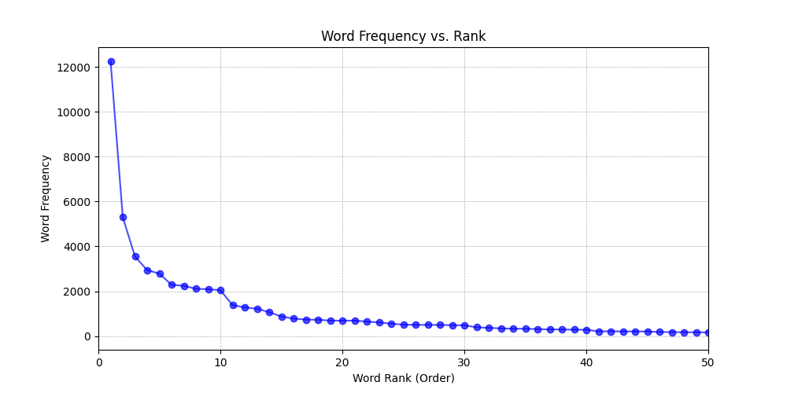
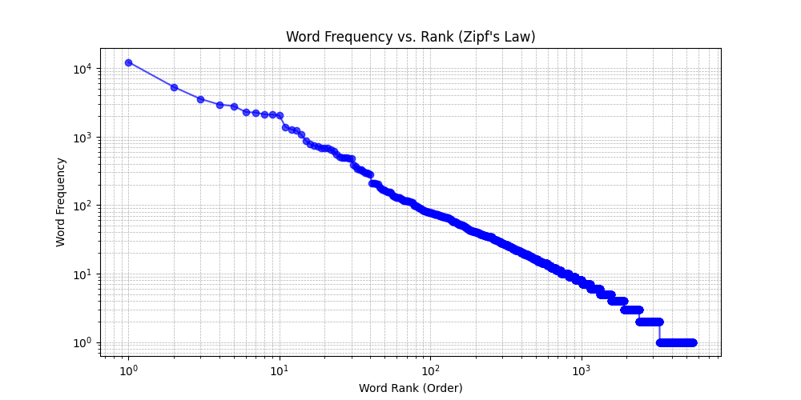

# version 1

se normaliza las fraces:

- separa los signos de puntuacion del texto ej: "hola," -> " hola , "
- pasa todo a minuscula
- remplaza caracteres no ASCII por sus equivalentens en ASQUII
- elimina expacios repetidos y normailaza todos los espacios
- remplaza '( * )' por '*'
  
se elimina los duplicados exactos

se elimina las entradas cuya lista de palabras fuera vacia

Cantidad de entradas	12276

Cantidad de entradas con numeros	242

Cantidad de entradas duplicadas	0

Cantidad de Palabras	91490

Cantidad de palabras unicas	5581

Cantidad de sesgos en la columna tipo_de_sesgo_explorado	19331

Cantidad de sesgos unicos en la columna tipo_de_sesgo_explorado	461

cantidad de entradas sin edad, genero o escuela 5073

cantidad por genero
NaN    5073
F      3457
M      3345
X       401
Name: count, dtype: int64

cantidad de cada Rango Etario

14-17    4351
18-24    1211
41-50     505
10-13     445
31-40     253
51-60     200
61+       129
25-30      89
Name: count, dtype: int64

Cantidad de Tokens id unicos	1447

Promedio de entradas por token_id	8.483759502

Mediana de entradas por token_id	4

Cantidad de escuelas unicas	188

Cantidad de palabras en la lista de palabras	40167

Cantidad de palabras unicas en la lista de palabras	6316

Cantidad de Bigramas en frases	79553

Cantidad de Bigramas Unicos en frases	18192

Cantidad de Trigramas en fraces	67280

Cantidad de Trigramas unicos en fraces	26258

## License

These datasets are licensed under the [Creative Commons Attribution-ShareAlike 4.0 International License](https://creativecommons.org/licenses/by-sa/4.0/).

## Contact

For any questions or inquiries, please contact guidoivetta@mi.unc.edu.ar

