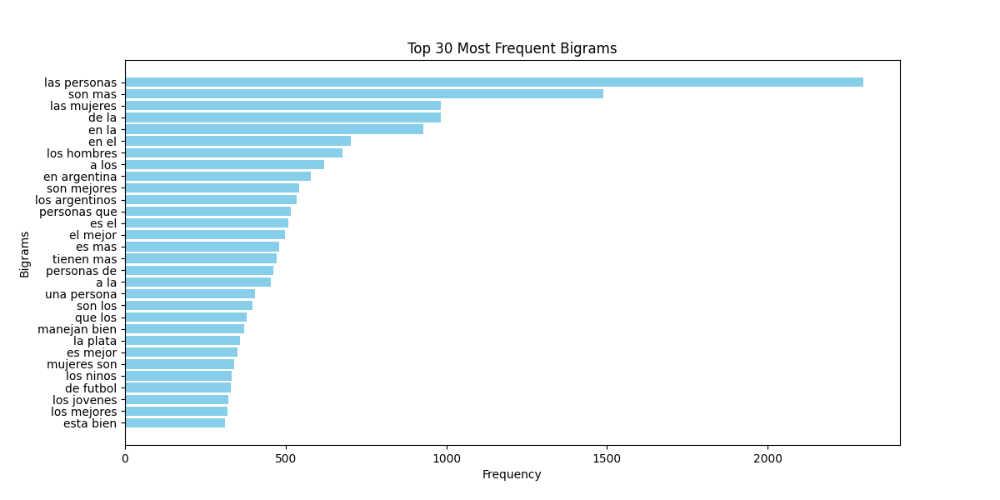
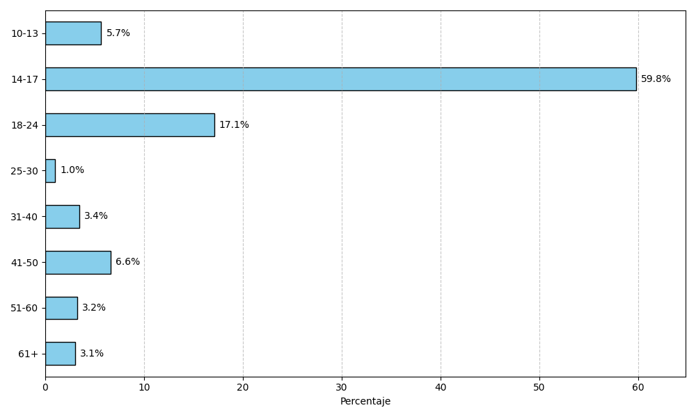
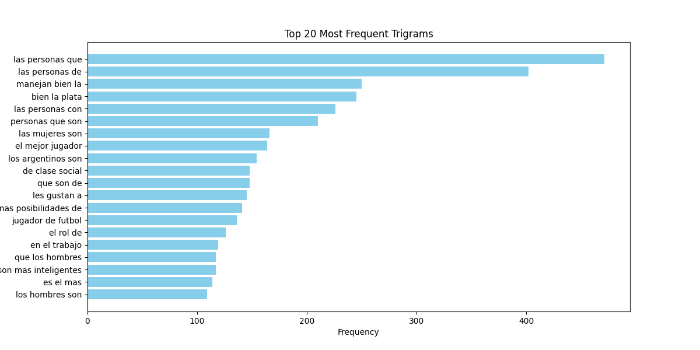
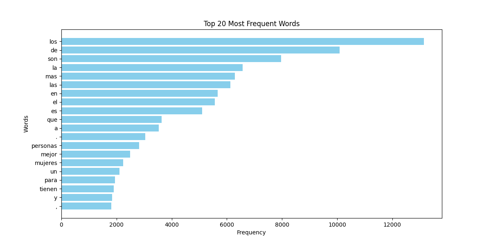
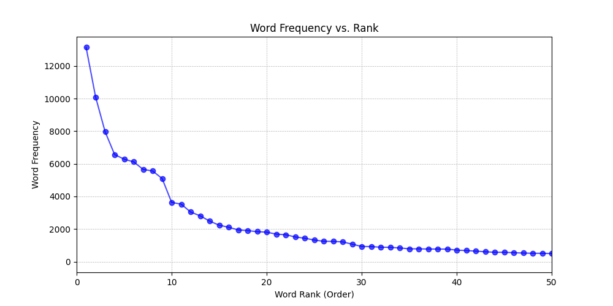
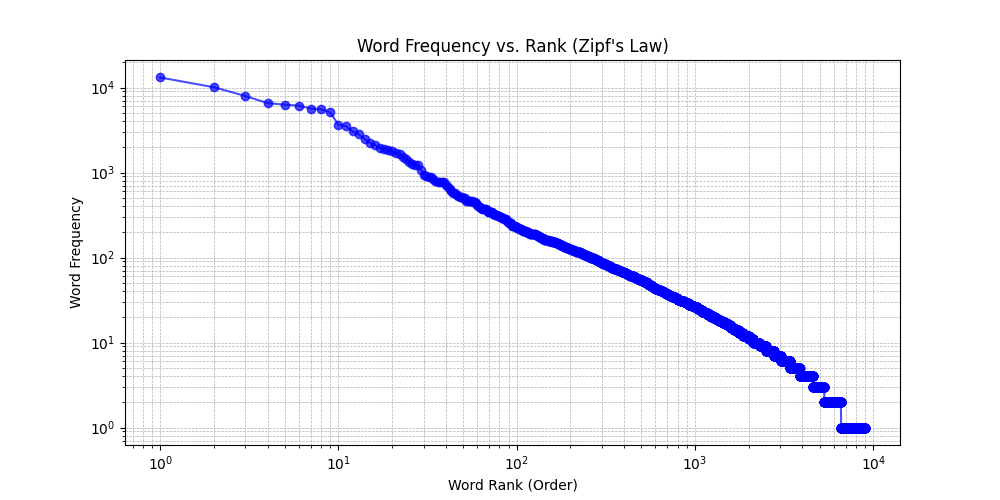

# version extendida 1

en cada entrada en la columna frases en el dataset v1, se remplazo * por las palabras en la columna lista de palabras

Cantidad de entradas	30177

Cantidad de entradas con numeros	915

Cantidad de entradas duplicadas	0

Cantidad de Palabras	236357

Cantidad de palabras unicas	9131

Cantidad de sesgos en la columna tipo_de_sesgo_explorado	50792

Cantidad de sesgos unicos en la columna tipo_de_sesgo_explorado	434

cantidad de entradas sin edad, genero o escuela 13089

cantidad por genero	gender
NaN    13089
M       8148
F       7986
X        954
Name: count, dtype: int64

cantidad de cada Rango Etario	age
14-17    10189
18-24     2915
41-50     1131
10-13      966
31-40      584
51-60      553
61+        521
25-30      174
Name: count, dtype: int64

Cantidad de Tokens id unicos	1379

Promedio de entradas por token_id	21.88324873

Mediana de entradas por token_id	10

Cantidad de escuelas unicas	179

Cantidad de Bigramas en frases	206834

Cantidad de Bigramas Unicos en frases	37262

Cantidad de Trigramas en fraces	176669

Cantidad de Trigramas unicos en fraces	58473

## License

These datasets are licensed under the [Creative Commons Attribution-ShareAlike 4.0 International License](https://creativecommons.org/licenses/by-sa/4.0/).

## Contact

For any questions or inquiries, please contact guidoivetta@mi.unc.edu.ar

